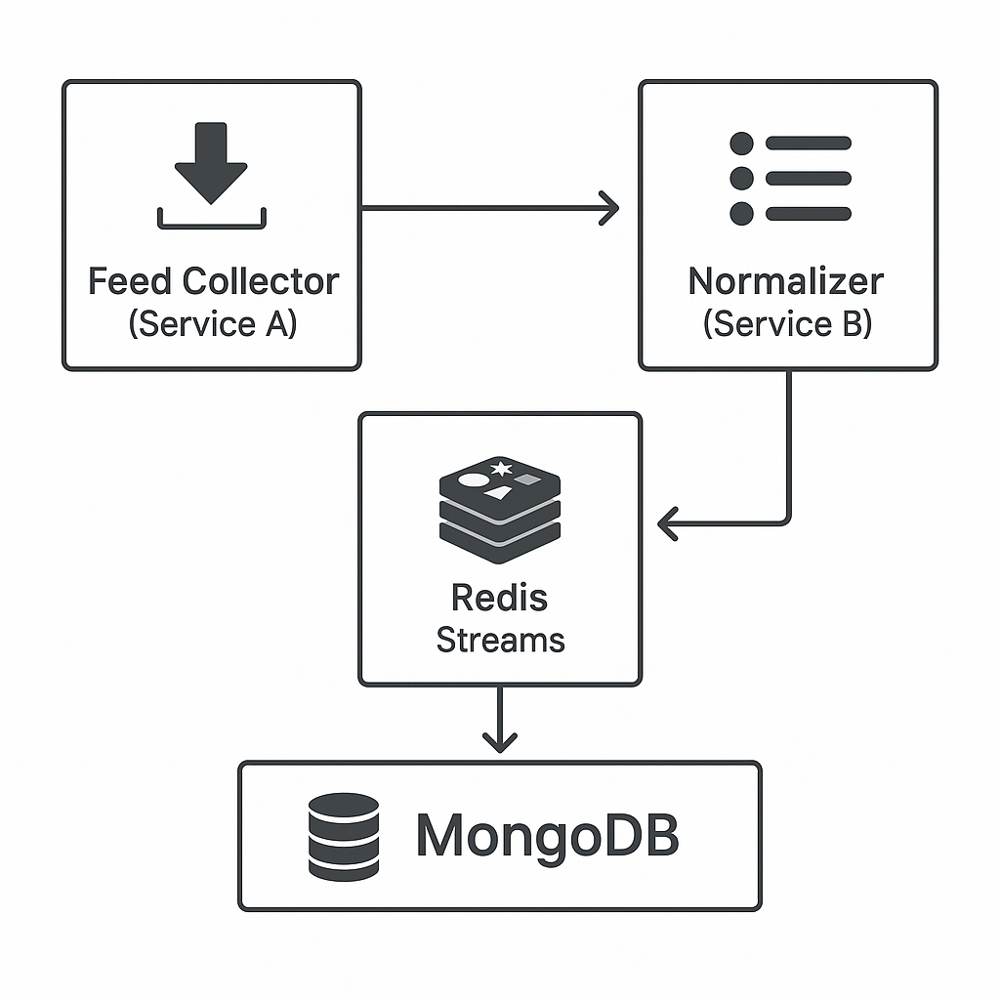

# FalconFeeds: Threat Intel Feed Collector & Normalizer

A microservice-based system that collects threat intelligence feeds from open sources, normalizes them to STIX 2.1 format, and makes them available for downstream consumption.



## System Overview

FalconFeeds consists of two core microservices:

1. **Feed-Collector**: Fetches threat intelligence from configured OSINT sources at regular intervals and publishes raw data to Redis Streams.
2. **Normalizer**: Processes raw feeds, extracts IOCs (IPv4, domains, SHA-256), converts them to STIX 2.1 format, and stores them in MongoDB.

### Supported Feed Types
- RSS Feeds
- JSON APIs
- Plain Text feeds with IOC patterns

### IOC Types Extracted
- IPv4 Addresses
- Domain Names
- SHA-256 Hashes

## Prerequisites

- Go 1.22+
- Docker and Docker Compose
- Make

## Quick Start

```bash
# Clone the repository
git clone https://github.com/anandsk10/falconfeeds.git
cd falconfeeds

# Start all services
make up

# Check service health
curl http://localhost:8081/healthz  # Normalizer

# Query for indicators
curl http://localhost:8081/indicators?value=example.com&limit=10
```

## Project Structure

```
.
├── Dockerfile.collector
├── Dockerfile.normalizer
├── Makefile
├── README.md
├── cmd
│   ├── collector
│   │   └── main.go
│   └── normalizer
│       └── main.go
├── docker-compose.yml
├── go.mod
├── go.sum
└── internal
    ├── collector
    │   ├── config
    │   │   ├── config.go
    │   │   └── malwarebazaar.zip
    │   ├── feeds
    │   │   └── collector.go
    │   ├── health
    │   │   └── server.go
    │   └── redis
    │       └── client.go
    └── normalizer
        ├── processor.go
        └── stix
            └── models.go
```

## API Endpoints

### Health Check
```
GET /healthz
```
Returns 200 OK if the service is healthy.

### Query Indicators
```
GET /indicators?value=<ioc>&limit=<num>
```
Parameters:
- `value`: (Optional) Specific indicator value to search for
- `limit`: (Optional) Maximum number of results (default: 100)

Response format:
```json
[
    {
        "_id": "6813b782417ed0af2990d80d",
        "created": "2025-05-01T18:03:46.142Z",
        "description": "Indicator for application/x-executable malware sample",
        "id": "indicator--a04a23fd-f3cf-422e-9874-98fda18f2aa4",
        "labels": [
            "malware",
            "application/x-executable"
        ],
        "modified": "2025-05-01T18:03:46.142Z",
        "name": "application/x-executable Indicator",
        "pattern": "[file:hashes.'SHA-256' = 'acb381f7cc65826fb1d99d645b90c23636fa858724f710f0aaf1a361dd9c0a1c']",
        "pattern_type": "stix",
        "spec_version": "2.1",
        "type": "indicator",
        "valid_from": "2025-05-01T18:03:46.142Z"
    },
    {
        "_id": "6813b782417ed0af2990d80e",
        "created": "2025-05-01T18:03:46.142Z",
        "first_observed": "2025-05-01T18:03:46.142Z",
        "id": "observed-data--dc4b3890-971a-4688-a673-c42544bc4b30",
        "last_observed": "2025-05-01T18:03:46.142Z",
        "modified": "2025-05-01T18:03:46.142Z",
        "number_observed": 1,
        "objects": {
            "0": {
                "extensions": {
                    "malware-bazaar": {
                        "file_name": "abuse_ch",
                        "file_type": "sshd",
                        "first_seen": "12:37:08\",",
                        "mime_type": "elf",
                        "reporter": "caf17afaaf976898f29d5a939828a57d1b348565",
                        "sha256_hash": "acb381f7cc65826fb1d99d645b90c23636fa858724f710f0aaf1a361dd9c0a1c",
                        "signature": "application/x-executable"
                    }
                },
                "hashes": {
                    "SHA-256": "acb381f7cc65826fb1d99d645b90c23636fa858724f710f0aaf1a361dd9c0a1c"
                },
                "mime_type": "sshd",
                "name": "abuse_ch",
                "type": "file"
            }
        },
        "spec_version": "2.1",
        "type": "observed-data"
    }
]
```

## Development

### Running Tests

```bash
# Run all tests
make test

# Run tests with coverage
make test-coverage
```

## Monitoring and Observability

The services expose Prometheus metrics at `/metrics` and support OpenTelemetry tracing. In the Docker Compose setup, traces are sent to Jaeger.

## Architecture Details

### Feed Collection Flow
1. Scheduler triggers collection at configured intervals
2. HTTP client fetches the feed with appropriate error handling
3. Parser extracts data from the specific format (RSS/JSON/Text)
4. Raw feed data is published to Redis stream `raw-feeds`

### Normalization Flow
1. Consumer reads from `raw-feeds` stream
2. IOC extractor identifies indicators using pattern matching
3. STIX builder converts each IOC to a STIX 2.1 indicator object
4. Normalized indicators are:
   - Published to Redis stream `stix-indicators`
   - Stored in MongoDB for persistence and querying

## Contributing

1. Fork the repository
2. Create a feature branch (`git checkout -b feature/amazing-feature`)
3. Commit your changes (`git commit -m 'Add amazing feature'`)
4. Push to the branch (`git push origin feature/amazing-feature`)
5. Open a Pull Request